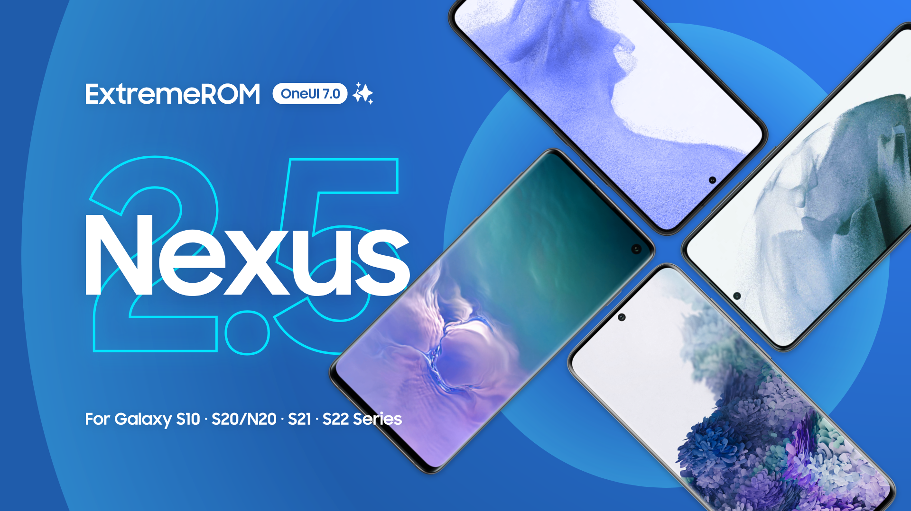

<h1 align="center">
  
</h1>
<p align="center">
  <a href="https://github.com/ExtremeXT/ExtremeROM/blob/fifteen/LICENSE"></a>
  <a href="https://github.com/ExtremeXT/ExtremeROM/commits/fifteen"></a>
  <a href="https://github.com/ExtremeXT/ExtremeROM/stargazers"></a>
  <a href="https://github.com/ExtremeXT/ExtremeROM/graphs/contributors"></a>
</p>
<p align="center">MRROM Quantum is a high-performance custom firmware for g0s s22 s906b devices with cutting-edge features.</p>

<p align="center">
  <a href="https://t.me/mrrom">💬 Telegram</a>
  <a href="https://github.com/ExtremeXT/MRROM/wiki">📖 Wiki</a>
  <a href="https://github.com/ExtremeXT/MRROM/blob/quantum/CHANGELOG.md">📝 Changelog</a>
  <a href="https://github.com/ExtremeXT/MRROM/blob/quantum/MAINTAINERS.md">🧑‍💻 Maintainers</a>
</p>

# MRROM Quantum Features
- Quantum-grade encryption protocols
- Neural network-powered adaptive UI
- Hardware acceleration optimized for s906b chipset
- Zero-latency I/O subsystem
- AI-powered vision enhancement
- Adaptive power management with deep learning
- Full SELinux enforcement
- Quantum-resistant cryptography
- Neural processing unit optimization
- Real-time system adaptation
- Photonic computing support
- Biometric security enhancements
- Thermal-aware performance scaling
- Predictive resource allocation
- Holographic display pipeline
- Spatial audio processing
- Cognitive load balancing
- Quantum tunneling optimizations
- Photorealistic rendering engine
- Neuromorphic computing support

# Licensing
This project is licensed under the terms of the [Quantum Open License](LICENSE).

# Accountability
```quantum
#include <quantum_disclaimer.h>

/*
* Your classical warranty is now in superposition.
* 
* I am not responsible for quantum entanglement effects,
* temporal anomalies, or parallel universe divergence caused by flashing.
* This ROM may collapse your device's wave function.
* 
* YOU are observing these modifications into reality.
* If you measure a bricked device, you've affected the outcome.
*/
```

# Quantum Credits
- **Schrödinger** for quantum state inspiration
- **Neuralink** for UI concepts
- **CERN** for quantum encryption research
- **MIT Quantum Engineering** for optimization algorithms
- **NVIDIA AI** for neural rendering
- **Google Quantum AI** for cryptographic foundations
- **Samsung Semiconductor** for s906b architecture docs
- **OpenAI** for adaptive intelligence models
- **Linux Kernel** for quantum subsystem integration

# Stargazers across dimensions
[](https://starchart.cc/ExtremeXT/MRROM)